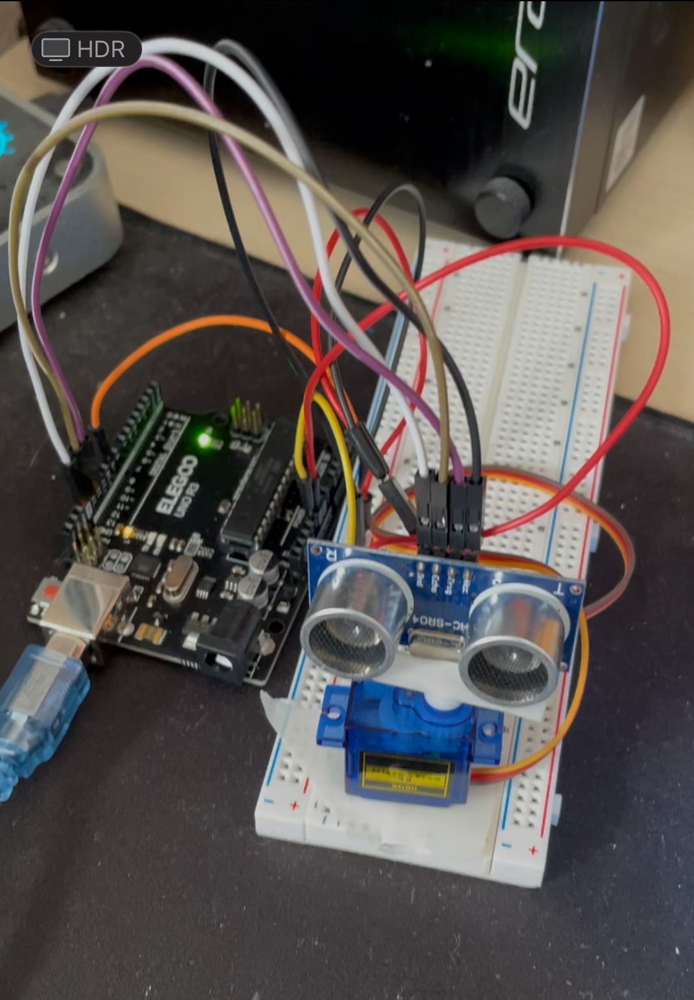

The code I put on the Arduino is in the Radar.ino file (I know that is technicly isn't a radar, but a sonar)

The code for the visualisation of a Mini-sonar is made in C++ and with the Raylib libary.

I built the Sonar with a Arduino, a ultrasonicsensor (HC-SR04-P) and a Micro Servo (TS90 A).

